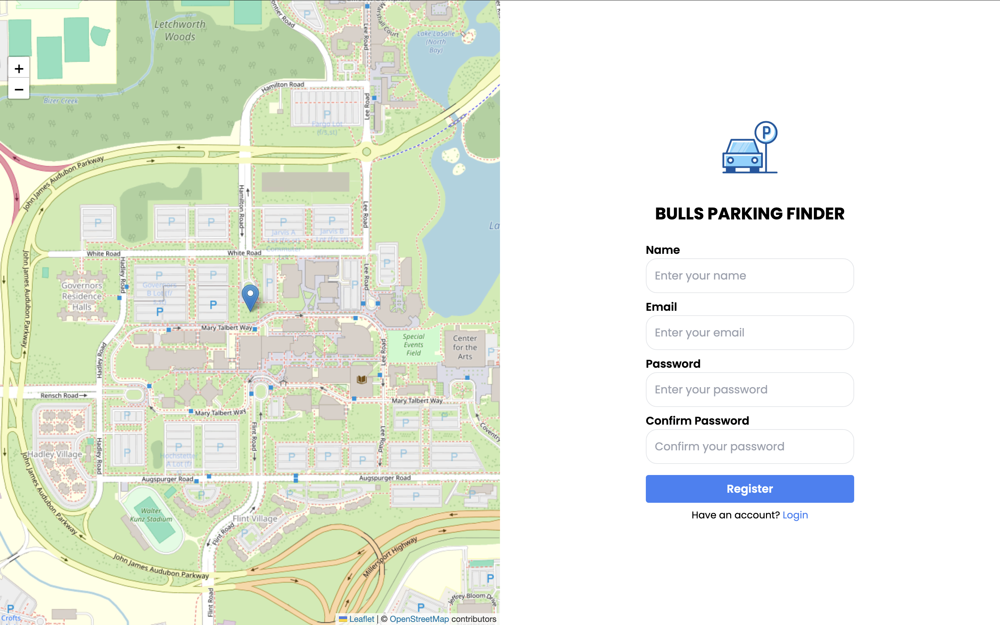
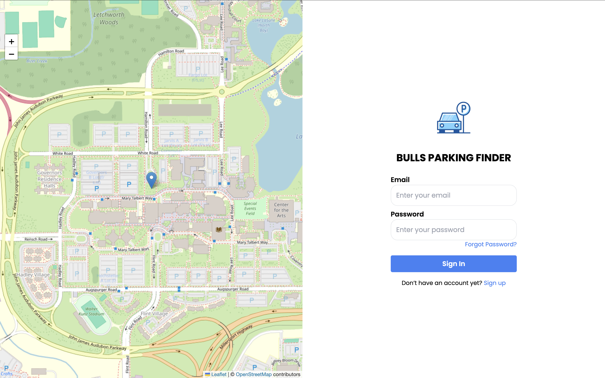
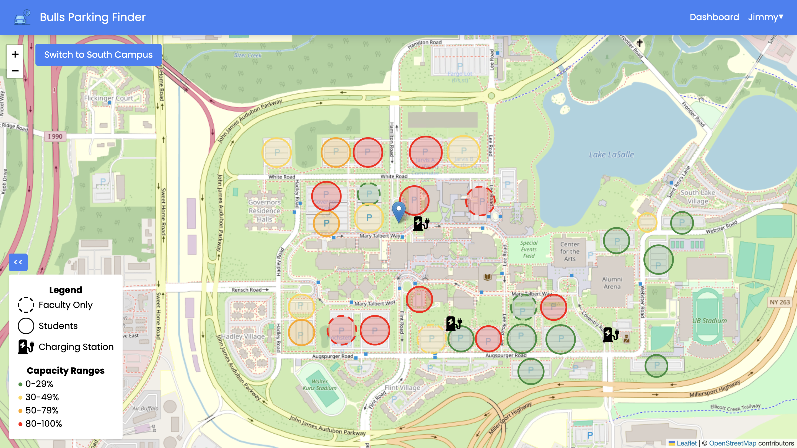

#  Bulls Parking Finder

Welcome to **Bulls Parking Finder**, a platform for finding available parking spots quickly and easily at UB campus! (Private class repo due to credentials)

The following demo videos and screenshots will guide you through the key features of the website that I have designed.

### Home Page

- The **Home Page** is the first page you see when you visit Bulls Parking Finder site.
- A simple, minimalistic user-friendly interface that gives you quick access to the sign up and login pages.

https://github.com/user-attachments/assets/62084450-3b63-4b73-9d4f-c1d04482c1a4

### Sign Up Page

The **Sign Up Page** allows users to create a new account to start using the Bulls Parking Finder platform.

- **Features:**
  - Clear instruction fields for creating an account.
  - Navigation to Login Page.
  - Name and Email must be unique.
  - Email must be Buffalo University email.
  - Password are hashed using Bcrypt.
  - Error handling for an already existing account.
  - Sanitizes inputs to prevent injection attacks.
  - Navigation back to Login Page after registration.

### Login Page

The **Login Page** allows registered users to log into their accounts securely.

- **Features:**
  - Error handling for nonexisting account or invalid password.
  - Option to reset the password if forgotten.
  - Navigation to Sign Up Page.
  - Directs to Dashboard page after successful login.
  - AuthToken is generated and stored in the local storage.

### Dashboard Page

The **Dashboard Page** is the main page where users can access real-time parking availability.

- **Features:**
  - Navigation between North and South Campus.
  - Displays a map of all parking lots on each campus.
  - Live map showing available parking spaces.
  - Provides an interactive interface to explore parking lot details and survey.
  - A clear and informative legend regarding parking lots and capacity ranges.
  - A Navbar to go to Dashboard, Settings or Logout.

### Capacity Survey Feature Demo

This video demonstrates the **Capacity Survey Feature**, where users can see the availability and capacity of parking spots in real-time.

- **Features:**
  - Provides a visual representation of parking lot capacity.
  - Allow users to input an estimate parking lot capacity.
  - Averages submitted survey capacity for each parking lot.
  - Real-time update of the parking capacities.
  - Handles abuse of survey inputs with penalization.
  - Error handling is user is penalized, survey will not be submitted.

https://github.com/user-attachments/assets/7e3349f4-02a1-4d02-9463-4f410912ebda

### Settings Demo

The **Settings** section lets users personalize their experience on Bulls Parking Finder. You can adjust notifications, and user profile.

- **Features:**
  - A user-friendly interface for modifying credentials.
  - Ability to upload their custom image or gif.
  - Options to turn on/off notifications for full capacity parking lots.

https://github.com/user-attachments/assets/8b7d745d-17f4-4138-b02d-627cf65818d9
